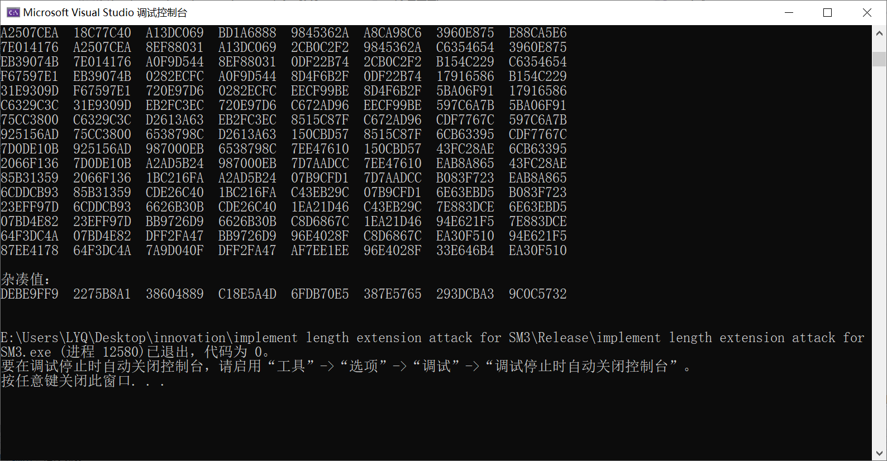
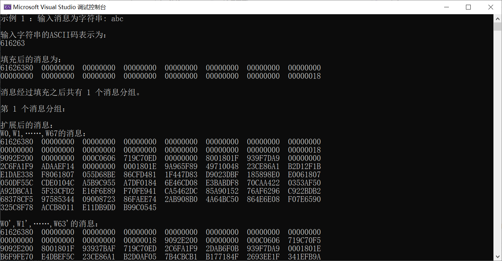

# 山东大学网络空间安全创新课实践项目
小组成员：孔德泓
## 项目名称
task1:implement length extension attack for SM3

task2:implement sm2 with RFC6979
## 项目简介
### 项目一
项目一实现了对sm3的实现以及基本的长度扩展攻击。将sm3的迭代过程需要的步骤分装成一个个函数，比如消息扩展，压缩，一些布尔函数等。在进行长度扩展攻击时在main函数完成了级联和填充得到扩展攻击后的杂凑值

string padding(string str) 按照sm3数据填充规则对数据进行填充 

string FF(string str1, string str2, string str3, int j) 实现布尔函数FF功能

string GG(string str1, string str2, string str3, int j) 实现布尔函数GG功能

string extension(string str) 消息扩展函数

string compress(string str1, string str2) 消息压缩函数

string iteration(string str) 迭代压缩函数实现

### 项目二
参考了https://sca.gov.cn/sca/xwdt/2010-12/17/1002386/files/b791a9f908bb4803875ab6aeeb7b4e03.pdf
查看了已有的实现，并使用了RFC6979实现了sm2的代码。

首先试下了一些椭圆曲线上的运算

def modinv(a,m)

def addition(x1,y1,x2,y2,a,p)

def mutipoint(x,y,k,a,p)

然后根据sm2的流程实现加解密的运算

def encrypt(m:str)

def decrypt(c1,c2,c3,a,b,p):

